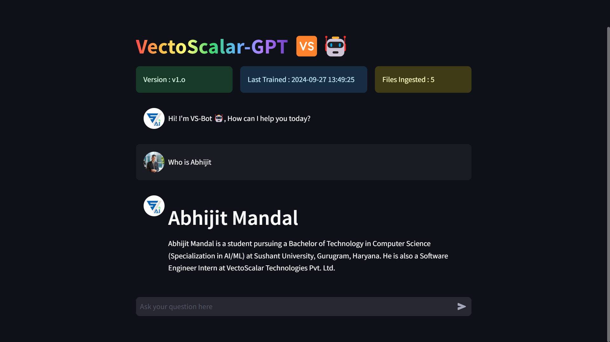
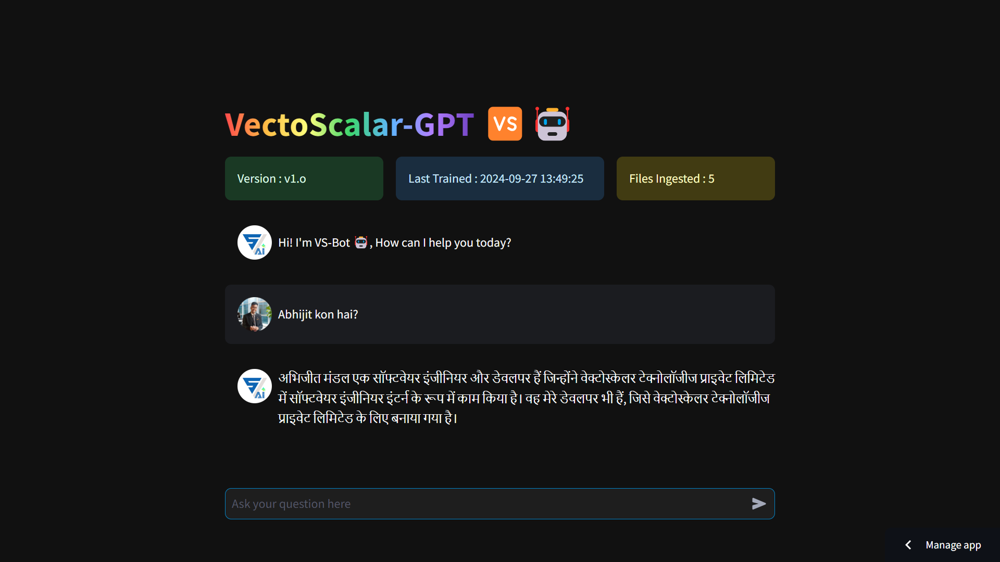
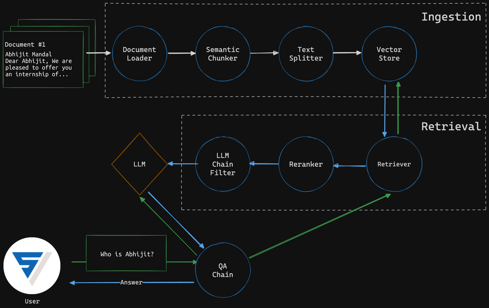

# VectoScalar-Bot 🤖

## Private Chat with Your Documents 📁
> _Completely Local ChatBot with Chat UI_


### Multilingual Support
> Need to mention it explicitly to get the response in desired language.

> Example Prompt could be: _I need the responses in `Hindi/Bengali` langauge from now onwards_...



## Demo
> Check out the Live Deployed [VS-GPT](https://vectoscalar-gpt.streamlit.app/). Runs with Groq API.

## Prerequisites

## Download & Install Python 

A Quick Guide for Installing Python on Common Operating Systems

1. [Install on Windows](#windows-)
2. [Install on MacOS](#macos-)
3. [Install on Linux](#linux-)

## Download & Install Ollama 

Get up and running with large language models.

### macOS

[Download](https://ollama.com/download/Ollama-darwin.zip)

### Windows preview

[Download](https://ollama.com/download/OllamaSetup.exe)

### Linux

```
curl -fsSL https://ollama.com/install.sh | sh
```

## Create a Python Virtual Environment.

```sh
python -m venv venv
```

## Activate the Virtual Environment.

```sh
venv/Scripts/activate
```

## Install Libraries
```sh
pip install uv
```
```sh
uv install poetry
```

## Installation

Clone the repo:

```sh
git clone git@github.com:vectoscalar/VectoScalar-GPT.git
cd VectoScalar-GPT
```

Install the dependencies (requires Poetry):

```sh
poetry install
```

Fetch your LLM (llama3:latest `Size → 4.7GB` by default):

```sh
ollama pull llama3:latest
```

Run the Ollama server

```sh
ollama serve
```

Start RagBase:

```sh
poetry run streamlit run app.py
```

## Architecture



### Ingestor

Extracts text from PDF documents and creates chunks (using semantic and character splitter) that are stored in a vector databse

### Retriever

Given a query, searches for similar documents, reranks the result and applies LLM chain filter before returning the response.

### QA Chain

Combines the LLM with the retriever to answer a given user question

## Tech Stack

- [Ollama](https://ollama.com/) - run local LLM
- [Groq API](https://groq.com/) - fast inference for mutliple LLMs
- [LangChain](https://www.langchain.com/) - build LLM-powered apps
- [ChromaDB](https://www.trychroma.com/) - vector search/database
- [FlashRank](https://github.com/PrithivirajDamodaran/FlashRank) - fast reranking
- [FastEmbed](https://qdrant.github.io/fastembed/) - lightweight and fast embedding generation
- [Streamlit](https://streamlit.io/) - build UI for data apps
- [PDFium](https://pdfium.googlesource.com/pdfium/) - PDF processing and text extraction

## Add Groq API Key (Optional)

You can also use the Groq API to replace the local LLM, for that you'll need a `.env` file with Groq API key:

```sh
GROQ_API_KEY=YOUR API KEY
```

Aliter → You can also use the Streamlit Secrets creating a `secrets.toml` file inside the `.streamlit` folder to add the Groq API

```sh
GROQ_API_KEY="YOUR API KEY"
```
